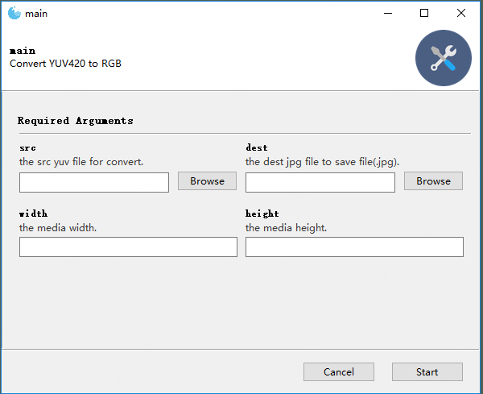

# yuvTools

## 介绍
这是一个yuv 转 rgb 图片工具，在某一次做视频处理项目中原始数据是 yuv

格式，在网上找了很多工具，发现都不是很好用，所以自己写了这么个工具，方便查看yuv 对应的图片；

目前这个算法是支持 yuv420 转rgb ，其他格式的yuv 格式未验证，在使用过程中你可以直接使用代码，或者自己编译出对应的exe文件

或者直接在git（或者gitee) 下载我已经编译好的exe 文件

## 技术要点

####  Gooey
   + 命令行转exe 界面库，如果你想把之前的命令行脚本转成界面工具，这个工具再需要不过了，用过就知道
####  pyinstaller
   + python 打包成可执行工具库
####  pillow
   + 图像处理库

## 安装
    pip install -r requirements.txt

## 打包文件
项目代码已经包含了 build.spec 文件，你只需要修改里面的参数 `pathex=['C:\\Users\siwenhu\\PycharmProjects\\yuvTools']`, 

改为自己的系统目录,然后执行：

    pyinstaller build.spec

## 说明
1.  本案例集在win10 上验证通过，mac os上没有验证

## 运行界面

  

